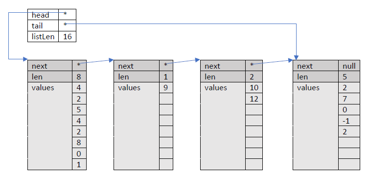
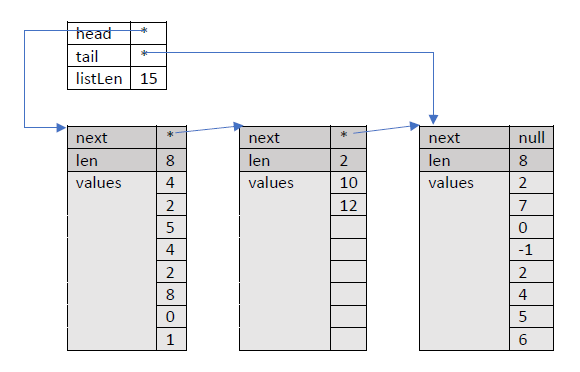
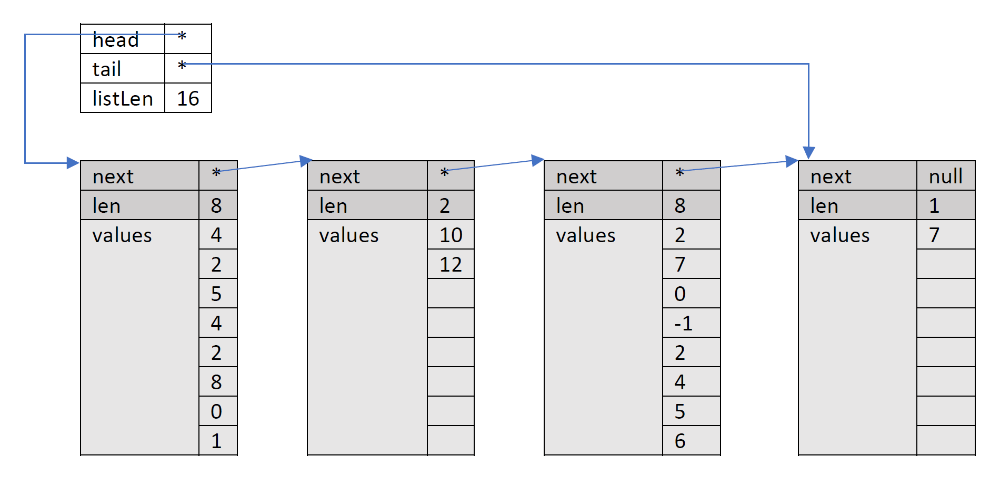
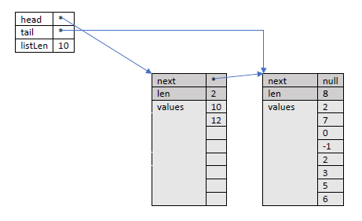
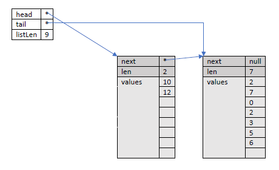
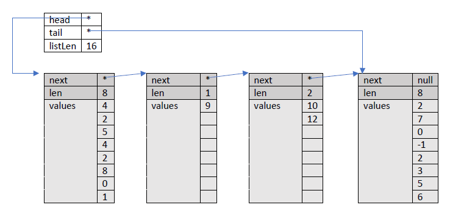
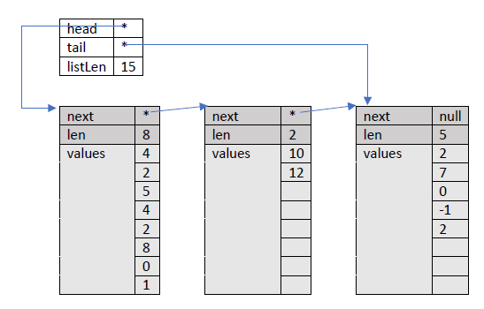
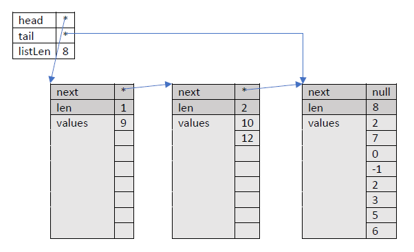
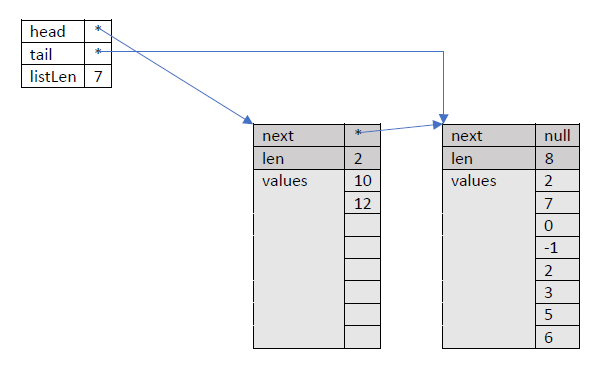

[](https://classroom.github.com/a/vkpsXLTf)
# ChunkList

[comment]: <> (Do not remove this!)


> **Note:** It will take 2-5 minutes for the points to update after you push.

Original ChunkList concept by Nick Parlante.  Adapted to an assignment by Varick
Erickson. Copyright (c) 2021 Varick Erickson.

## Deliverables

| Deliverable        | Points |
| ------------------ | ------:|
| Constructor_Test   |  7     |
| Template_Test      |  2     | 
| Append_Remove_Test | 19     |
| Iterator_Test      | 11     |
| Index_Test         | 11     |
| Commits            |  8     |
| Commenting         |  4     |
| Answer to Questions|  8     |
| **Total**          | **70** |

The same standards for commits and comments apply for this assignment as the 
previous assignment.

## Questions

1. ***What is the advantage of the ChunkList approach as opposed to a standard 
  the link list implementation?*** (1 point)
   > Your answer here
   

2. ***What would be the implications of increasing the size of ARRAY_SIZE to a 
   very large value?  For example, what if you plan to use this structure to 
   store around 1,000 values and you made ARRAY_SIZE 1,000?***
   
   > Your answer here

   
3. ***What is the Big O of:*** (1 point each)
   
   | Function | Big O (worst case) |
   | ---------| ------------------ |
   | Append   | Your answer here   |
   | Remove   | Your answer here   |
   | GetLength| Your answer here   |
   | GetIndex | Your answer here   |
   | Contains | Your answer here   |  
 

4. ***Compare placing a new element into the *FIRST* available empty space 
   versus placing a new element in the tail chunk. What are the advantages and 
   disadvantages to automatically placing values at the tail node?*** (1 point)
   
   > Your answer here

## Run Configurations

You will need to set the working directory to $PROJECT_DIR$ for the 
following run configurations:

* `Append_Remove_Test`
* `Constructor_Test`
* `Index_Test`
* `Iterator_Test`  
* `Template_Test`

The `Chunklist_Test` should be configured as a catch test (this is the same 
process as the previous assignment) and the working directory should also be 
$PROJECT_DIR$.

## Introduction
A ChunkList is like a regular linked list, except each node contains a little
fixed size array of elements instead of just a single element. Each node also 
contains its own `len` int to know how full it is.

The ChunkList object contains a head pointer to the first chunk, a tail 
pointer to the last chunk, and an int to track the logical size of the whole 
collection. When the size of the list is 0, the head and tail pointers are 
null.  The following is an example of what a ChunkList looks like. 

> ***Note:*** While this example shows integer, the actual implementation 
> should utilize templates and can accept any type.



- Each chunk contains a fixed size `T[]` array (in the above example `T` is an 
int), an int to track how full the chunk is, and a pointer to the next chunk.
The type `T` should be defined by the template as shown in the examples given in
class.

- There should be a constant ARRAY_SIZE = 8 that defines the fixed size of the
  array of each chunk. Elements should be added to the array starting at its
  0 index.

- `listLen` shows the length of the entire length.  `len` shows the length 
  of a node.

- An empty ChunkList should be implemented as null head and tail pointers.
Your ChunkList should allocate chunks only when actually needed and delete 
them when no longer needed.

## Unit Test Dependencies - IMPORTANT
Many of the tests depend on certain functions to work in order
for the tests to pass successfully. Here is a table of the
dependencies.

| Unit test          | Dependencies                               |
| ------------------ | ----------------------------               |
| Constructor_Test   | Constructors, Append, Contains, GetLength  |
| Append_Remove_Test | Append, Remove, Contains, LoadFactor       |
| Index_Test         | Append, Remove, GetIndex                   |
| Iterator_Test      | Append, Remove, ResetIterator, GetNextItem |

For example, the Constructor_Test requires `Append`, `GetLength`, and 
`Contains` to work for the test to work properly.  You can also verify
dependencies by looking directly at the tests.

## Recommended Implementation Order
The following is a recommended order to implement the functions.  This is 
not mandatory, but you may find it helpful to follow this order.
1. `ChunkList()`
2. `GetLength()`,`IsEmpty()`
3. `LoadFactor()`
4. `Append(T)`
5. `Contains()`
6. `Remove(T)`
7. `ChunkList(arr, arrLen)`
8. `GetIndex(int)`
9. `ResetIterator()`,`GetNextItem()`
10. `~ChunkList()`


## Function Description

Each section below describes how each function should behave.  Be sure to 
read the descriptions carefully.

---

## `ChunkList()`
The default constructor should create an empty ChunkList.  An empty 
ChunkList should be implemented as null head and tail pointers.  You should 
also initialize the variables related to the iterator.

---

## `ChunkList(T[] arr, arrLen)`
This constructs a ChunkList using the values from arr.  It should append all 
the values from `arr` to the list. The parameter `arrLen` is the length of arr.
If `arrLen` is an invalid array length, you should throw a `InvalidArrayLength
()`.  You should initialize the iterator to start at the beginning of the list.

> **HINT**: You should use the `Append` function here.

---

## `~ChunkList();`
This is the deconstructor for the list.  It will remove all the nodes in the 
list. In this particular case, it will actually be the same code as we used 
in other implementations of linked lists we cover in class. Note that while 
this function is not graded, you should probably implement it.

> **WARNING**:  An improperly implemented deconstructor can crash ***ALL*** 
> of your tests.  This is because the deconstructor is automatically called 
> at the end of a test. This will prevent all tests afterwards from being run.

---

## `bool IsEmpty()`
This function should return true if the list is empty.

---

## `int GetLength()`
GetLength should return the length of the entire list. It does not return 
the number of nodes/chunks. For example, in this example GetLength() 
function should return 16.


> **HINT**: You should update the length any time you add/remove 
> items.

---

## `double LoadFactor()`

The load factor is the following value tells us what percentage of the 
ChunkList is actually storing items.  It is calculated using the following:

```
load factor = listLen/(total number of spots in the ChunkList)
```
This function should throw an `EmptyList()` error if
the list is empty.

> **Example:**
>
> The load factor of the the following ChunkList is
> 
> ```load factor = 16/(8*4) = 0.5```
> 
> This means that only 50% of the ChunkList space is being used to store 
> items.  The other 50% is empty.
> 
> 

---

## `bool Contains(T value)`
This function returns true if `value` exists in the ChunkList.  To do this,
you need to check the array of each node until you find `value` or you reach
the end of the list without finding `value`. This function should throw an `EmptyList()` error if
the list is empty and you attempt to find an item.

Here is a rough algorithm:

```
while(current node has not reached the end of the list) {
   for (each index in the current node) {
      if values[index] of the current node is the value you are looking for
         return true
   }
}
return false
```

---

## `void Append(T value)`
This function appends `value` to the end of the list.  This function should 
do the following.
  - Attempt to add the value to the last position of the last node
  - If the last node is full when you try to add `value`, then a new node should 
    be created and placed at he end of the list. `value` can then be added 
    to this new last node.
  - ***Be sure to update any book keeping variable!***

> **Example:** Suppose we add the value 7 to the following list.
> 
> ***Before adding 7***
> 
> 
>
> Since the last node is full, we need to make a new node and add it to the 
> end. The 7 would then be placed at the first position of the new node.
> 
> ***After adding 7***
> 
> 

---

## ```void Remove(T value)```
This function should find the ***first*** instance of value and remove it 
from the list.  When it removes the element, ***it should preserve the order of 
the list***.  In other words, the order of the other elements of the list 
should not be changed.  You will need to shift elements in the node in order 
to accomplish this.  This function should throw an `EmptyList()` error if 
the list is empty and you attempt to remove an item.

Below we show several scenarios your remove function should be able to handle.

### NOTE 
*THESE EXAMPLES DO NOT COVER ALL THE CASES YOUR REMOVE SHOULD BE ABLE TO 
HANDLE.*

> **Example:** Removing from a node
>
> Suppose we remove -1 from the following list
>
> ***Before removal***
> 
> 
>
> ***After removal***
> 
> 

> **Example:** Removing the last element in a node
> 
> Suppose we remove 9 from the following list
> 
> ***Before removal***
> 
> 
> 
> Removing 9 would make the node empty.  This means you would remove the node.
> 
> ***After removal***
> 
> 

> **Example:** Removing last element in the head 
> 
> Suppose we remove 9 from the following list.
> 
> ***Before removal***
> 
> 
> 
> Removing 9 would make the head empty.  If this happens, then you should 
> delete the old head and update the head pointer.
> 
> ***After removal***
> 
> 

---

## `T GetIndex(int i)`

`GetIndex(i)` returns the value at index i with reference to the entire list.
For example, for the list given at the beginning of the assignment, `GetIndex
(8)` would return the 0th element of the second node, which is the value 9.


This function should throw an `EmptyList()` error if
the list is empty.  It should also throw an `IndexOutOfBounds()` error if you 
provide a bad index.

Good implementations should be able to "skip" over nodes if it is known that 
the index i is not within the node.  We can use len of each node to help us 
figure do this skipping. Here are some scenarios that will help you develop 
an algorithm to do this "skipping". Assume curr is a pointer to a node and 
starts at the head.

The rough algorithm is:
```c++
while(curr is not at the end of the list) {
    if (i is less than the curr node length){
        i is within the curr node array and we can return the element
    }
    update the value of i to begin at the next node by subtracting the curr node len

    update curr to the next node
}
```


> **Example:** Suppose we call `GetIndex(3)`
> 
> 
> 
> `i` will be within the first node since `i < curr->len`.
> 
> In this case we return curr->values[i].

> **Example:** Suppose we call `GetIndex(7)` 
>
> 
> 
> `i` will be within the first node since `i < curr->len`.

> **Example:** Suppose we call `GetIndex(9)`
>
> Ultimately, this should return the 0th element of the 3rd node, which is
> the value 10.  Let's apply the algorithm. **Drawing a picture for yourself 
> is highly recommended.**
> 
> 
> 
> `i` will ***NOT*** be within the first node 
> 
> `i` is ***NOT*** less than `curr->len` in this case.
>
> Since we know we are not in the first node, we will need move `curr` to the 
> next node. Before we move to the next node, we update `i` 
> 
> ```
>  i = i - curr->len;    // i = 9 - 8
> ``` 
>
> `i` would now have the value 1.  
> 
> After updating `i`, we update `curr` be the next node and check `i < curr->len` 
> Note that `curr->len` is now 1 This is because the second node only has 
> 1 element in the array (i.e. `curr` is now the node with single 9 in it).
>
> `i` will ***NOT*** be within the curr node since `i` is NOT less than `curr->len` 
>
> `i == curr->len` in this case
>
> We update `i = i - curr->len`.  So now `i` now has the value 0. After 
> updating `i` we move `curr` to the next node.
> 
> `i` is within the `curr` node since `i < curr->len`
> 
> We return the value `curr->values[i]` which is 10.

---

## `void ResetIterator()`
This function should set the `iterNode` to the first node of the list and 
set the `arrPos` to point to the first index.

## `T GetNextItem()`
This function returns the current item and moves to next item in the list.  
It should work exactly the same way as the other iterators we covered in class.  
It should throw an `IteratorOutOfBounds()` error if the user tries to get 
another item and no item is available.

The main issues to solve for this function are:
- When do you move to the next node?
- How do you know when you have reached the end of the array of the `iterNode`?
- How do you know when you have reached the end of the list?

There are several workable strategies, but all of them address these issues.
